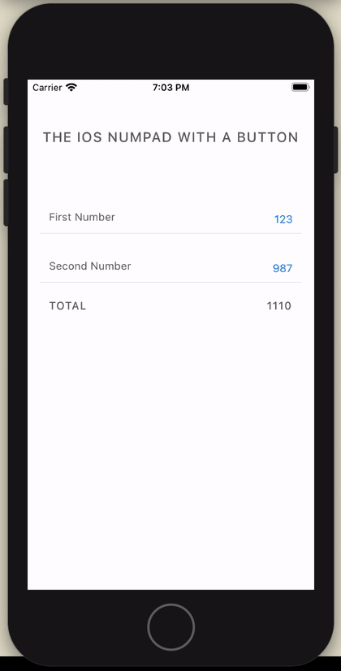

# The iOS Numpad Keyboard with a Custom Button Example

An example of using React Native [InputAccessoryView](https://facebook.github.io/react-native/docs/inputaccessoryview).

The InputAccessoryView is a component that enables customization of the keyboard input accessory view on iOS. The input accessory view is displayed above the keyboard whenever a TextInput has focus. This component can be used to create custom toolbars.

Please read more in this [article](https://dev.to/vladimirvovk/react-native-ios-keyboard-with-a-custom-button-15h0).

</img>

## Installation

1. Clone the repo
2. Change directory to the app: `cd ios-numpad-with-custom-button`
3. Install all dependencies: `yarn install`
4. Run the app: `yarn start`

## Expo

You can also run this app with [Expo](https://exp.host/@vladimir_vovk/ios-numpad-with-custom-button).
